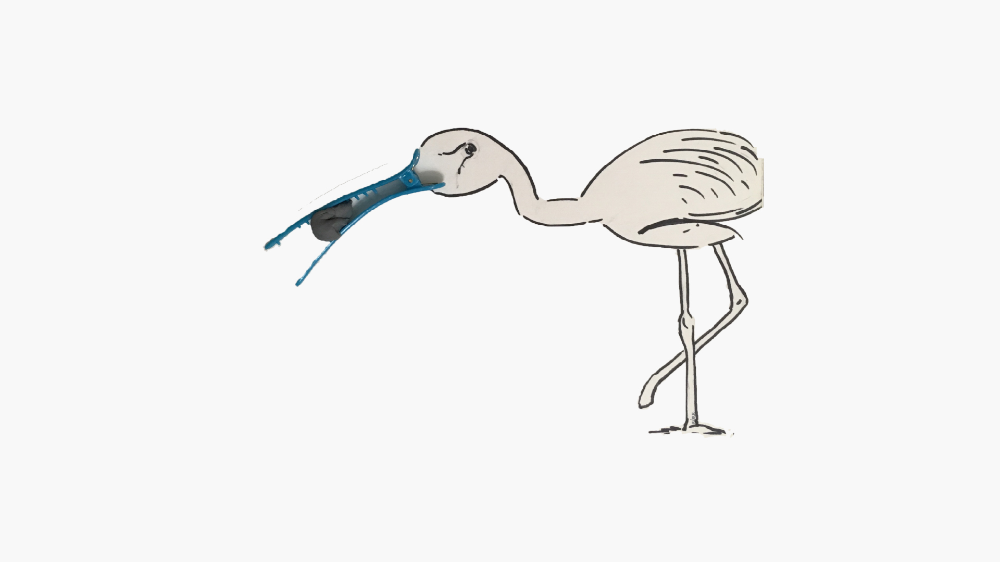
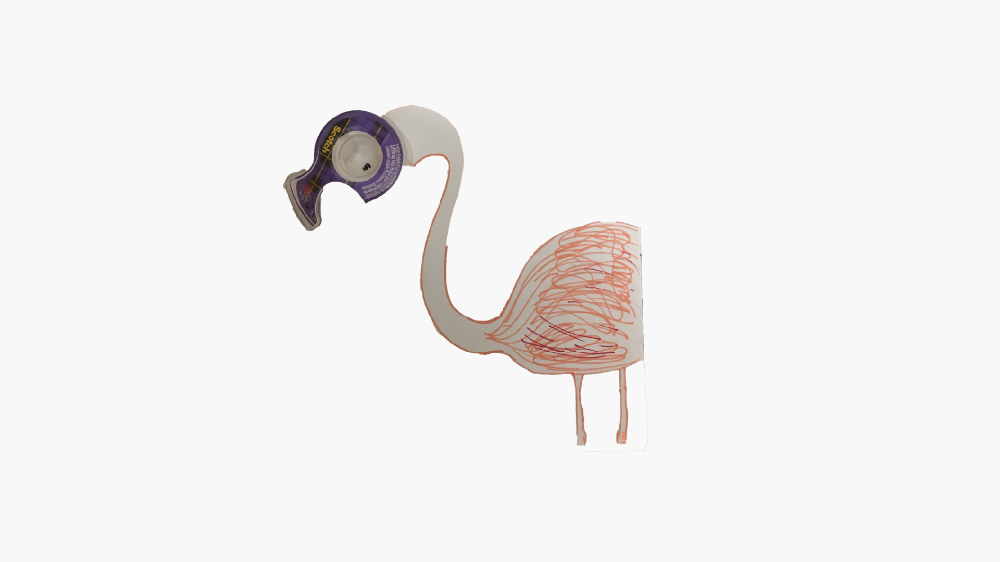
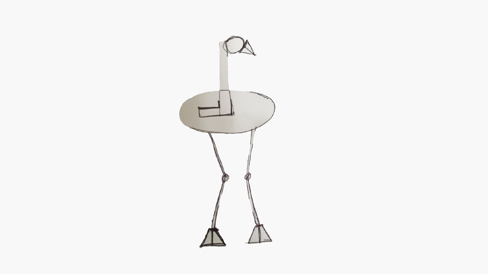

## Abstractions

This section is a part of the [Flamingo Project](https://www.nimu.work/project-flamingo/). Go check it out!

As I desperately tried to think of concepts to draw the bird, motivation struck by simply taking time to look around! 

After scouring through household objects, I came across these pair of kitchen pincers that reminded me of a bird in flight. Now, all I had to do was add a beak and a set of wings to set the bird in motion.

  

Yes! You guessed that right! That's a 'Duck- teeth' hairclip which formed the beak of my flamingo. Used some kneaded eraser as its food. :)

  

Can you think of anything better to represent the head other than the scotch tape? It fits perfectly, doesn't it? 

  

How about a very basic skeleton using just geometric shapes? Go on, you can try this too. Hardly took me 2 minutes! 
