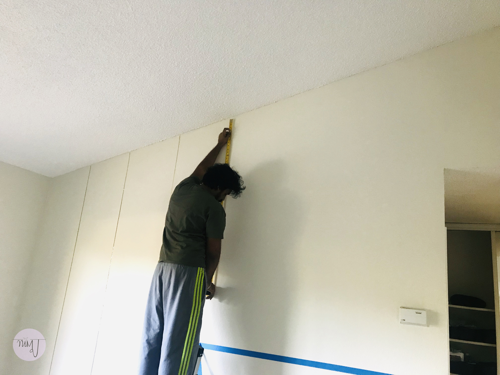
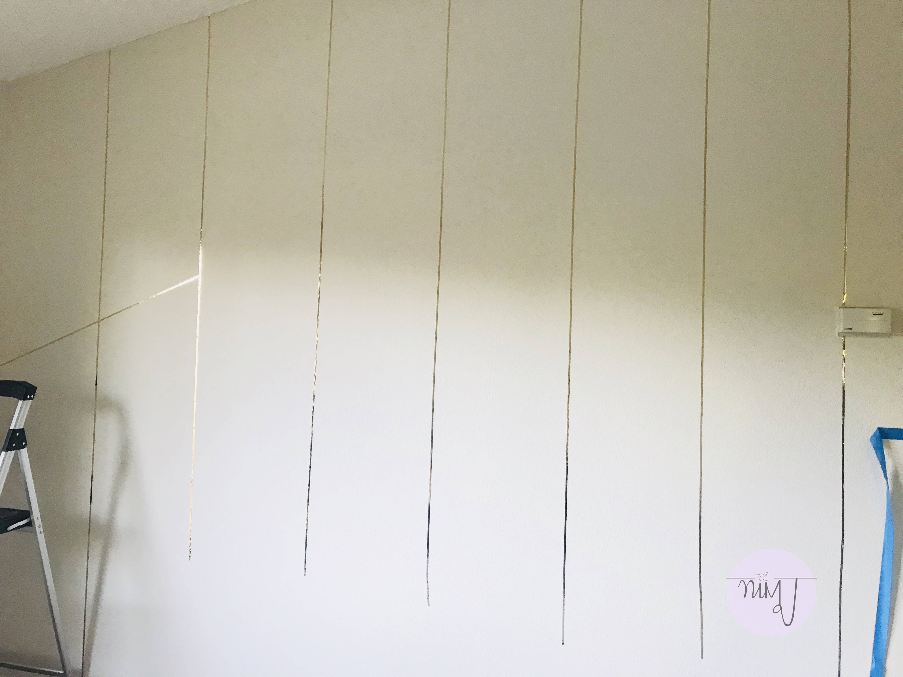
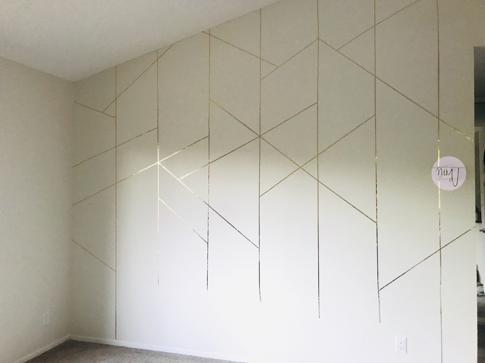

## DIY Accent Wall

Hello people!!

How are you guys doing? Trying to keep yourselves occupied during this lockdown? Here's a simple DIY to keep you busy for a while.

Don't we all love coming home to a beautiful space? Some say how we decorate our home is a reflection of our personality. Whether you're a believer in this saying or not, whether you like clean, minimalistic spaces, bright or bold spaces, we all have a preference. <del>Well, mostly.</del>

I, for one, personally like spaces that look classy but with a hint of quirk. When it comes to Living Rooms especially, I like them to be peppy and functional. I'm one of those people who loves to have people come over and hosting Game Nights is a ritual in the D household. 

I live in a rental in California and like most renters, I care about getting my entire safety deposit back most when it is time to move. Since painting walls is not allowed and/or is a hassle in rentals, here's a quick DIY that will instantly brighten the vibe of your apartment and make it look like your dream home! 

Also, what better time to do it than during the lockdown?!! So, let's get started.

Things you'll need:

As exciting as shopping sounds, I'm sure if you just look around, you might find everything you need. PLEASE STAY HOME.

1. Tape - Any tape will do. Washi, Colour, Metallic, decorative, coloured Duct tape, Gorilla tape. Just Anything.
2. Scale/ Measuring tape
3. A ladder/ Stool 
4. <del> That's it</del>

DESIGN TIP #1: Locate the focal wall in your room. Where do you want the design/pattern to be? 
HINT: It is usually the first thing people see when they enter the room. <del> Or not </del> You decide!

  

DESIGN TIP #2
Feel the texture of the wall and understand the tone of the wall colour. 

My wall was painted a light cream beige colour and so
I decided to use a golden metallic tape to highlight the colour of my wall. Makes sense?

  

Finally, Its time to work on the pattern. You could make any pattern using the tape you have. Be creative! 

DESIGN TIP #3
It's always a good idea to first sketch the pattern out on a piece of paper before marking the wall. If you want perfection, I recommend you use a design software to precisely measure and sketch. ([SketchUp] (https://www.sketchup.com/) is the easiest for beginners.)

For my wall, I chose a geometric pattern using parallel and diagonal lines. 
Start marking the wall using a light pencil. Once you're satisfied, use the markings as a guide to applying the tape. 

  

DESIGN TIP #4
I will highly recommend you to finish making lines/patterns in one direction first before adding lines/patterns in another. This will keep the work in order and reduce confusion.

Once you're done, don't forget to trim the edges and clean up loose ends, if any. Finally, add furniture and accessories. Don't forget to give yourself a pat for making good use of the time. 

  

Watch the video below to see how I decorated my Living area. Let me know what you think of this. 

<iframe width="560" height="315" src="https://www.youtube.com/embed/8Kab08TJIJg" frameborder="0" allow="accelerometer; autoplay; encrypted-media; gyroscope; picture-in-picture" allowfullscreen></iframe>

